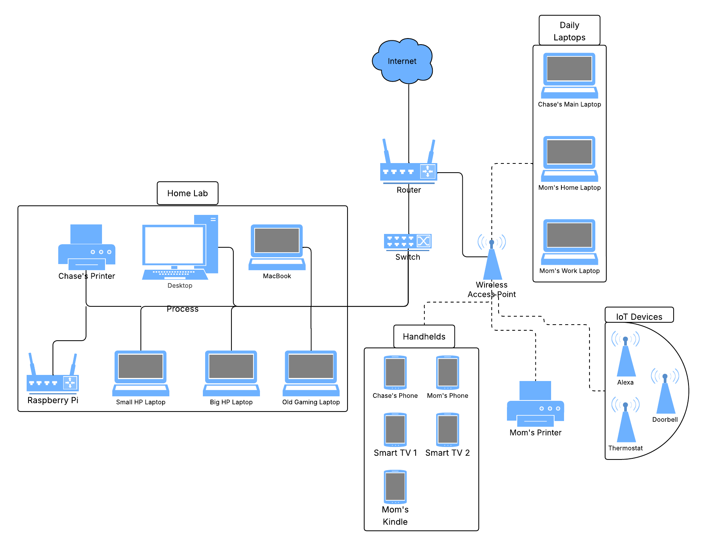

# Chase Cooley Cybersecurity Portfolio

**Aspiring SOC Analyst** | UMGC Master’s in Cybersecurity Management & Policy (Graduating August 2026)  
**CompTIA A+ (Core 1 Complete)** | **Security+ (In Progress)**  
  
Clearwater, FL | [LinkedIn](https://www.linkedin.com/in/chase-cooley-245812199/) | [Hack The Box](https://profile.hackthebox.com/profile/019d1209-4247-708d-838e-7480fd574451)

## Welcome
This repository showcases my hands-on cybersecurity journey — home lab projects, certifications, incident response practice, risk & compliance documentation, and real support work through CoolUnderFire Cybersecurity LLC.  

It demonstrates practical skills that go beyond theory, with clear documentation, screenshots, and SOC Analyst relevance throughout.

## Portfolio Sections

| Section                        | Focus Area                              | Highlights |
|--------------------------------|-----------------------------------------|----------|
| [certifications](./certifications) | CompTIA A+ & Security+ progress        | Detailed tracking, lab reinforcement |
| [home-lab](./home-lab)         | Full lab environment & projects         | AD, Networking, Wazuh SIEM, troubleshooting |
| [htb-tryhackme](./htb-tryhackme) | Practical offensive/defensive practice | Starting Point, SOC Analyst path |
| [incident-response-practice](./incident-response-practice) | SOC triage & IR simulations            | Wazuh alerts, malware, phishing, ransomware |
| [risk-compliance-docs](./risk-compliance-docs) | Policies, risk assessments             | Risk register, access control, GDPR checklist |
| [scripting-automation](./scripting-automation) | PowerShell & Python automation        | AD scripting, Wazuh alert parsing |
| [CoolUnderFire-Cybersecurity-LLC](./CoolUnderFire-Cybersecurity-LLC) | Real support tickets & business        | Live IT/security support documentation |

## Key Strengths
- **Hands-on Lab**: Production-like environment with SIEM, AD, firewall, and segmentation
- **SOC Focus**: Strong incident response, alert triage, and defensive documentation
- **Compliance & Policy**: Risk management and policy artifacts from Master’s coursework
- **Automation**: Scripting examples for real efficiency gains
- **Real-World**: CoolUnderFire Cybersecurity LLC support experience

## Skills Matrix
See [Skills-Matrix.md](./Skills-Matrix.md) for a detailed overview of technical skills, certifications, and projects.

## Network Diagram

## Next Goals (by August 2026 Graduation)
- Pass A+ Core 2 and Security+
- Complete HTB Starting Point + THM SOC Level 1
- Document 15–20+ lab & IR projects
- Launch CoolUnderFire support tickets
- Apply to entry-level SOC Analyst / Security Operations roles in Tampa Bay

**Last Updated**: May 2026
**Availability**: Open to junior SOC Analyst, Security Operations, or Help Desk-to-SOC positions.

Thank you for visiting — feel free to explore the folders above!

## Repository Structure
- **home-lab/** → VirtualBox setups, Windows troubleshooting, Active Directory basics (A+ focus)
- **htb-challenges/** → Hack The Box Academy modules & Starting Point write-ups (threat/vuln practice)
- **incident-response-practice/** → Mock alert triage and mini-incident scenarios (SOC triage basics)
- **risk-compliance-docs/** → Sample risk assessments & policy snippets (Master's & Chargebacks911 ties)

## Highlighted Work
- **Windows Client Troubleshooting Lab** → [home-lab/windows-client-troubleshooting/](home-lab/windows-client-troubleshooting/)  
  Simulated help desk tickets: driver issues, connectivity, password resets.
- **Active Directory Basics** → [home-lab/active-directory-basics/](home-lab/active-directory-basics/)  
  User/group management, Group Policy — common MSP/help desk tasks.
- **HTB Starting Point Write-ups** → [htb-challenges/starting-point/](htb-challenges/starting-point/)  
  Basic exploitation, privilege escalation, log analysis.
- **Mock SOC Alert Triage** → [incident-response-practice/mock-alert-triage/](incident-response-practice/mock-alert-triage/)  
  Simulated alerts with triage steps and escalation rationale.

